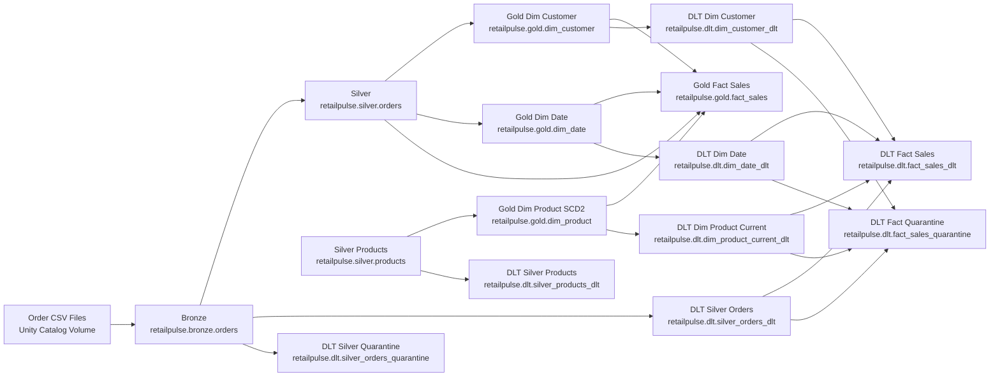

# RetailPulse: Databricks Lakehouse Retail Analytics Project

RetailPulse is a Databricks Lakehouse project that demonstrates a medallion-style retail analytics platform using Unity Catalog, Delta Lake, Auto Loader, SCD Type 2 dimensions, and Delta Live Tables for data quality validation.

The project simulates retail order ingestion, curates Bronze-Silver-Gold datasets, builds star-schema style dimensions and facts, and adds a DLT quality layer with curated outputs and quarantine tables for rejected or unresolved records.

## Highlights

- Databricks Lakehouse with Unity Catalog
- Bronze-Silver-Gold data engineering pattern
- Auto Loader ingestion for landed order files
- Silver-layer validation, casting, and deduplication
- SCD Type 2 `dim_product`
- Gold fact table `fact_sales`
- DLT quality pipeline with `*_dlt` and `*_quarantine` outputs
- Prompt-driven AI-assisted development using reusable project skills

## Project Structure

```text
RetailPulse/
|-- notebooks/
|   |-- 01_data_generator.py
|   |-- 02_bronze_ingestion.py
|   |-- 03_silver_transform.py
|   |-- 04_dim_tables.py
|   |-- 05_fact_tables.py
|   `-- 06_dlt_pipeline.py
|-- config/
|   |-- pipeline_config.json
|   `-- dlt_pipeline_config.json
|-- src/utils/
|   |-- delta_utils.py
|   `-- validation_utils.py
|-- .ai/
|   |-- context/
|   `-- skills/
`-- sync_to_workspace.ps1
```

## Architecture Diagram



## Core Tables

### Base Medallion Tables

- `retailpulse.bronze.orders`
- `retailpulse.silver.orders`
- `retailpulse.silver.products`
- `retailpulse.gold.dim_product`
- `retailpulse.gold.dim_customer`
- `retailpulse.gold.dim_date`
- `retailpulse.gold.fact_sales`

### DLT Quality Tables

- `retailpulse.dlt.silver_orders_dlt`
- `retailpulse.dlt.silver_orders_quarantine`
- `retailpulse.dlt.silver_products_dlt`
- `retailpulse.dlt.dim_product_current_dlt`
- `retailpulse.dlt.dim_customer_dlt`
- `retailpulse.dlt.dim_date_dlt`
- `retailpulse.dlt.fact_sales_dlt`
- `retailpulse.dlt.fact_sales_quarantine`

## Reproduce The Project

### Prerequisites

- Databricks workspace with Unity Catalog enabled
- permissions to create catalog, schemas, volumes, tables, and DLT pipelines
- a compute cluster for notebooks
- serverless pipelines enabled for DLT in your workspace
- this repo cloned locally or synced into Databricks workspace

### Step 1: Sync Project To Databricks Workspace

If working locally and using the same sync approach as this repo:

```powershell
powershell -ExecutionPolicy Bypass -File .\sync_to_workspace.ps1
```

### Step 2: Run The Base Notebooks In Order

Run these notebooks in Databricks in the following order:

1. `notebooks/01_data_generator.py`
   Generates synthetic order CSV files into the Unity Catalog volume.

2. `notebooks/02_bronze_ingestion.py`
   Uses Auto Loader to ingest the landed files into `retailpulse.bronze.orders`.

3. `notebooks/03_silver_transform.py`
   Cleans, casts, validates, and deduplicates records into `retailpulse.silver.orders`.

4. `notebooks/04_dim_tables.py`
   Builds `retailpulse.silver.products`, maintains `retailpulse.gold.dim_product`, and creates `dim_customer` and `dim_date`.

5. `notebooks/05_fact_tables.py`
   Creates `retailpulse.gold.fact_sales` from silver orders and gold dimensions.

### Step 3: Create And Run The DLT Pipeline

This project includes a DLT pipeline config at `config/dlt_pipeline_config.json`.

Create the pipeline:

```powershell
databricks pipelines create --json @config/dlt_pipeline_config.json --profile shekartelstra
```

Start an update:

```powershell
databricks pipelines start-update <PIPELINE_ID> --profile shekartelstra
```

Notes:

- the DLT pipeline is configured for serverless compute
- the DLT target schema is `retailpulse.dlt`
- the DLT notebook is `notebooks/06_dlt_pipeline.py`
- base medallion tables must exist before the DLT pipeline is run

## How The DLT Layer Works

- `*_dlt` tables are curated DLT-managed outputs
- `*_quarantine` tables capture rejected or unresolved records with `dq_reason`
- `silver_orders_dlt` applies validation and deduplication to bronze orders
- `fact_sales_dlt` only keeps fully resolved fact rows
- `fact_sales_quarantine` stores rows that fail dimension resolution for remediation and replay

## Validate The Build

Run these queries in Databricks SQL or a notebook after execution:

```sql
SELECT COUNT(*) FROM retailpulse.bronze.orders;
SELECT COUNT(*) FROM retailpulse.silver.orders;
SELECT COUNT(*) FROM retailpulse.gold.dim_product;
SELECT COUNT(*) FROM retailpulse.gold.dim_customer;
SELECT COUNT(*) FROM retailpulse.gold.dim_date;
SELECT COUNT(*) FROM retailpulse.gold.fact_sales;
SELECT COUNT(*) FROM retailpulse.dlt.silver_orders_dlt;
SELECT COUNT(*) FROM retailpulse.dlt.silver_orders_quarantine;
SELECT COUNT(*) FROM retailpulse.dlt.fact_sales_dlt;
SELECT COUNT(*) FROM retailpulse.dlt.fact_sales_quarantine;
```

Inspect current-product SCD quality:

```sql
SELECT product_id, COUNT(*) AS current_count
FROM retailpulse.gold.dim_product
WHERE is_current = true
GROUP BY product_id
HAVING COUNT(*) > 1;
```

Inspect quarantined fact rows:

```sql
SELECT dq_reason, COUNT(*) AS row_count
FROM retailpulse.dlt.fact_sales_quarantine
GROUP BY dq_reason
ORDER BY row_count DESC;
```

## Experiment Ideas

- change DLT expectations from soft `expect` to `expect_or_drop` or `expect_or_fail` and compare behavior
- add new DQ rules for category validation, timestamp sanity, or duplicate detection
- extend product master generation so more fact rows resolve successfully into `fact_sales_dlt`
- replace current-mode product joins with historical SCD joins based on event timestamp
- add remediation status columns and replay logic on quarantine tables
- introduce inventory or returns pipelines using the same project skill pattern

## AI-Assisted Build Pattern

This repo also includes project-specific AI skills under `.ai/skills/` for:

- bronze pipeline generation
- silver transformation logic
- SCD2 merge patterns
- fact table build patterns
- streaming pipeline guidance

See `.ai/skills/README.md` for sample prompts and end-to-end usage guidance.

## Current Limitations

- `dim_product` is currently seeded from a small sample product dataset
- fact resolution can fail for product IDs not present in that sample, which is why quarantine handling is useful
- the current project uses `ingest_ts` as the date driver instead of a true business order timestamp

## Repository

GitHub repository:

`https://github.com/somaazure/RETAILPULSE-databricks-lakehouse`
