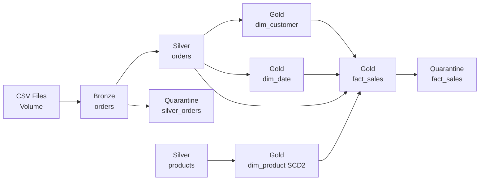

# RetailPulse: Databricks Lakehouse Retail Analytics Project

RetailPulse is an enterprise-grade Databricks Lakehouse project with **metadata-driven data quality, maintenance, and audit frameworks**.

## Architecture Overview

RetailPulse demonstrates two complementary architectures:

### 1. **Data Pipeline Architecture** (ETL/ELT)
- `Enterprise hybrid mode`: DLT for Bronze and Silver, Jobs/Workflows for Gold dimensions and facts
- Streaming ingestion and row-level DQ in DLT
- Business modeling in modular downstream jobs

### 2. **Metadata-Driven Framework Architecture** (Governance)
- Centralized metadata catalog for tables, columns, and validation rules
- Automated data quality validation
- Policy-driven table maintenance (OPTIMIZE/VACUUM/ANALYZE)
- Comprehensive audit logging and reporting

---

## 🔄 Complete End-to-End Execution Order

### **STEP 1: Data Pipeline (Every 4 hours)**
**Job**: `RetailPulse Enterprise Orchestrator` (ID: 869046484148482)  
**Duration**: ~15-20 minutes

**Tasks**:
1. **bronze_silver_dlt** - DLT Pipeline
   - Ingests CSV files → Bronze layer (`retailpulse.bronze.orders`)
   - Validates & cleanses → Silver layer (`retailpulse.silver.orders`)
   - Captures invalid records → Quarantine (`retailpulse.ops.silver_orders_quarantine`)

2. **gold_dims_facts** - Gold Layer Job
   - Builds product master (`retailpulse.silver.products`)
   - Builds SCD2 product dimension (`retailpulse.gold.dim_product`)
   - Builds customer dimension (`retailpulse.gold.dim_customer`)
   - Builds date dimension (`retailpulse.gold.dim_date`)
   - Builds sales fact table (`retailpulse.gold.fact_sales`)
   - Captures unresolved facts → Quarantine (`retailpulse.ops.fact_sales_quarantine`)

---

### **STEP 2: Data Quality Validation (After STEP 1)**
**Notebook**: `RetailPulse/01_DQ_Framework/03_DQ_Framework`  
**Duration**: ~5-10 minutes  
**Dependency**: Requires fresh data from STEP 1

**Operations**:
1. **Freshness Checks** - Validate SLA compliance (last_altered timestamps)
2. **Quality Rules Checks** - Validate column constraints (NOT_NULL, POSITIVE, DATE_VALID, etc.)
3. **Completeness Checks** - Validate row counts

**Logs to**: `retailpulse.ops.dq_validation_audit`

---

### **STEP 3: Table Maintenance (Weekly - Sunday 1 AM)**
**Notebook**: `RetailPulse/02_Maintenance/04_Maintenance_Framework`  
**Duration**: ~30-60 minutes  
**Independent**: Can run anytime

**Operations**:
1. **OPTIMIZE** - Compact small files for query performance
2. **ZORDER** - Co-locate related data (order_date, customer_id)
3. **VACUUM** - Remove old files to reclaim storage
4. **ANALYZE** - Collect table statistics for query optimization

**Logs to**: `retailpulse.ops.maintenance_audit`

---

### **STEP 4: Health Reporting (Daily 9 AM / On-Demand)**
**Notebook**: `RetailPulse/03_Reporting/05_Audit_Reporting`  
**Duration**: ~2-5 minutes

**Reports**:
- DQ check pass rates and trends
- ETL job performance metrics
- Maintenance operation effectiveness
- Executive dashboard

**Reads from**: All audit tables in `retailpulse.ops.*`

---

## 📋 Quick Reference: Execution Frequency

| Step | What to Run | When | Dependency |
|------|-------------|------|------------|
| 1️⃣ | RetailPulse Enterprise Orchestrator | Every 4 hours | None (runs first) |
| 2️⃣ | 03_DQ_Framework | After Step 1 | Requires fresh data |
| 3️⃣ | 04_Maintenance_Framework | Weekly (Sundays) | Independent |
| 4️⃣ | 05_Audit_Reporting | Daily / On-demand | Requires audit data |

---

## 📂 Project Structure (Organized by Function)

```text
RetailPulse/
├── 00_Setup/                    # One-time setup (run once)
│   ├── 01_Setup_Audit_Tables
│   └── 02_Metadata_Configuration
├── 01_DQ_Framework/             # Data quality validation (run after data load)
│   └── 03_DQ_Framework
├── 02_Maintenance/              # Table optimization (run weekly)
│   └── 04_Maintenance_Framework
├── 03_Reporting/                # Health monitoring (run daily)
│   └── 05_Audit_Reporting
├── 04_Orchestration/            # Reserved for future pipeline notebooks
├── 05_Documentation/            # Architecture & guides
│   └── RetailPulse Framework Architecture
├── 99_Archive/                  # Archived utilities
│   └── src/utils/
├── notebooks/                   # Active data pipeline notebooks
│   ├── 08_dlt_e2e_main_refresh.py
│   ├── 09_product_master.py
│   ├── 10_dim_product.py
│   ├── 11_dim_customer.py
│   ├── 12_dim_date.py
│   └── 13_fact_sales.py
├── config/                      # Job & pipeline configurations
│   ├── dlt_bronze_silver_pipeline.json
│   ├── job_gold_dims_facts.json
│   └── job_enterprise_orchestrator.json
├── .ai/                         # AI context and skills
│   ├── context/
│   ├── skills/
│   └── prompts/
└── README.MD                    # This file
```

---

## 🗄️ Data Architecture

### **Medallion Layers**


### **Audit & Governance Tables**
All stored in `retailpulse.ops` schema:

| Table | Purpose | Updated By |
|-------|---------|------------|
| `metadata_catalog` | Central registry for tables, columns, rules, policies | Manual config |
| `dq_validation_audit` | Logs DQ check results | DQ Framework |
| `etl_job_audit` | Tracks ETL pipeline runs | Orchestrator Job |
| `maintenance_audit` | Records OPTIMIZE/VACUUM/ANALYZE ops | Maintenance Framework |
| `table_change_audit` | Captures data lineage & changes | Trigger-based |

---

## 🚀 Initial Setup (One-Time)

### 1. Create Audit Tables & Configure Metadata
```bash
# Run these notebooks once
RetailPulse/00_Setup/01_Setup_Audit_Tables
RetailPulse/00_Setup/02_Metadata_Configuration
```

### 2. Create DLT Pipeline
```powershell
databricks pipelines create --json @config/dlt_bronze_silver_pipeline.json --profile <your-profile>
```

### 3. Create Orchestrator Job
```powershell
databricks jobs create --json @config/job_enterprise_orchestrator.json --profile <your-profile>
```

---

## 📅 Recommended Scheduling (Databricks Jobs)

### Job 1: RetailPulse Enterprise Orchestrator
```yaml
Schedule: 0 0 0,4,8,12,16,20 * * ? *  # Every 4 hours
Timeout: 30 minutes
Alerts: Email on failure
```

### Job 2: RetailPulse DQ Validation
```yaml
Notebook: RetailPulse/01_DQ_Framework/03_DQ_Framework
Schedule: 0 0 6,18 * * ? *  # Twice daily at 6 AM and 6 PM
Dependency: Runs after Orchestrator succeeds
Timeout: 30 minutes
Alerts: Email on failure
```

### Job 3: RetailPulse Maintenance
```yaml
Notebook: RetailPulse/02_Maintenance/04_Maintenance_Framework
Schedule: 0 0 1 ? * SUN *  # Sundays at 1 AM
Timeout: 2 hours
Alerts: Email on failure
```

### Job 4: RetailPulse Health Report (Optional)
```yaml
Notebook: RetailPulse/03_Reporting/05_Audit_Reporting
Schedule: 0 0 9 * * ? *  # Daily at 9 AM
Timeout: 15 minutes
Output: Email summary to leadership
```

---

## 🔍 Validation Queries

### Data Pipeline Validation
```sql
-- Bronze/Silver/Gold counts
SELECT COUNT(*) FROM retailpulse.bronze.orders;
SELECT COUNT(*) FROM retailpulse.silver.orders;
SELECT COUNT(*) FROM retailpulse.silver.products;
SELECT COUNT(*) FROM retailpulse.gold.dim_product;
SELECT COUNT(*) FROM retailpulse.gold.dim_customer;
SELECT COUNT(*) FROM retailpulse.gold.dim_date;
SELECT COUNT(*) FROM retailpulse.gold.fact_sales;

-- Quarantine counts
SELECT COUNT(*) FROM retailpulse.ops.silver_orders_quarantine;
SELECT COUNT(*) FROM retailpulse.ops.fact_sales_quarantine;
```

### Framework Health Validation
```sql
-- Recent DQ checks
SELECT check_category, status, COUNT(*) 
FROM retailpulse.ops.dq_validation_audit 
WHERE run_timestamp >= current_timestamp() - INTERVAL 24 HOURS
GROUP BY check_category, status;

-- Recent maintenance operations
SELECT operation, status, COUNT(*)
FROM retailpulse.ops.maintenance_audit
WHERE start_time >= current_timestamp() - INTERVAL 7 DAYS
GROUP BY operation, status;

-- DQ pass rate
SELECT 
  ROUND(SUM(CASE WHEN status = 'PASS' THEN 1 ELSE 0 END) * 100.0 / COUNT(*), 2) AS pass_rate_pct
FROM retailpulse.ops.dq_validation_audit
WHERE run_timestamp >= current_timestamp() - INTERVAL 7 DAYS;
```

---

## 📊 Framework Features

### Metadata-Driven Configuration
- **Centralized catalog**: All tables, columns, validation rules in one place
- **Dynamic checks**: DQ framework reads metadata and generates checks automatically
- **Policy-based maintenance**: OPTIMIZE/VACUUM/ANALYZE driven by metadata policies

### Data Quality Validation
- **Freshness checks**: SLA validation against last_altered timestamps
- **Quality rules**: NOT_NULL, POSITIVE, NON_NEGATIVE, DATE_VALID, EMAIL_FORMAT
- **Completeness checks**: Row count validation
- **Audit logging**: All results logged with pass/fail status, violation counts

### Table Maintenance
- **OPTIMIZE**: Compact small files (with ZORDER on configured columns)
- **VACUUM**: Remove old files (configurable retention hours)
- **ANALYZE**: Collect table statistics for query optimizer
- **Metrics tracking**: Before/after file counts and sizes

### Reporting & Monitoring
- **DQ trends**: Pass rates over time
- **ETL performance**: Job duration, row counts, failures
- **Maintenance effectiveness**: Space saved, files compacted
- **Executive dashboard**: Overall health metrics

---

## 🏗️ Enterprise Design Principles

### Why This Architecture?

**DLT for Streaming & Quality**:
- Schema drift, rescue data, and streaming ingestion handled by DLT
- Row-level expectations enforce quality at ingestion

**Jobs for Business Logic**:
- Gold layer changes frequently with business rules
- Modular jobs reduce blast radius and enable independent reruns
- SCD policies, backfills, and release cycles easier to manage

**Metadata-Driven Framework**:
- Centralized configuration eliminates scattered validation logic
- Audit logging enables trend analysis and alerting
- Policy-based maintenance ensures consistent performance

---

## 📁 Configuration Files

| File | Purpose |
|------|---------|
| `config/dlt_bronze_silver_pipeline.json` | DLT pipeline definition |
| `config/job_gold_dims_facts.json` | Gold layer job definition |
| `config/job_enterprise_orchestrator.json` | Orchestrator job definition |

---

## 🔗 Repository

`https://github.com/somaazure/RETAILPULSE-databricks-lakehouse`

---

## 📚 Additional Documentation

- **Framework Architecture**: See `RetailPulse/05_Documentation/RetailPulse Framework Architecture` notebook
- **README Guide**: See `RetailPulse/README - Framework Guide` notebook
- **AI Context**: See `.ai/context/architecture.md` for detailed architecture documentation
- **AI Skills**: See `.ai/skills/` for operation-specific guidance

---

## 🎯 Success Metrics

**Data Pipeline Health**:
- Bronze → Silver → Gold data flows successfully
- Quarantine tables capture invalid records
- All dimension and fact tables populated

**Framework Health**:
- DQ checks: 95%+ pass rate
- Maintenance: Weekly optimizations complete successfully
- Audit logs: All operations tracked with metrics

**Operational Readiness**:
- Jobs scheduled and running on cadence
- Alerts configured for failures
- Dashboards available for monitoring

---

## 📝 Notes

### One-Time Cutover
If your workspace has Gold tables from an older DLT-managed branch:
1. Stop the old DLT pipeline
2. Backup existing `retailpulse.gold.*` tables
3. Drop DLT-managed versions
4. Let enterprise notebooks recreate as standard Delta tables

### Framework Notebooks
- **Setup notebooks (00-02)**: Run once during initial setup
- **DQ Framework (03)**: Run after every data load
- **Maintenance (04)**: Run weekly
- **Reporting (05)**: Run daily or on-demand
