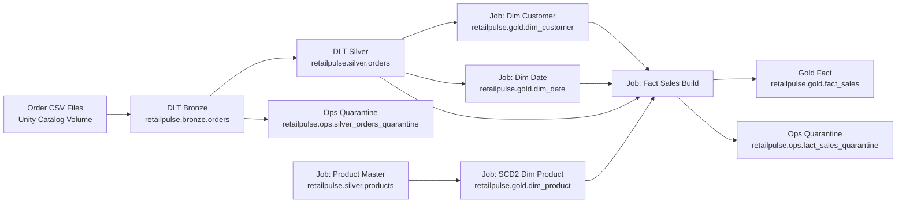

# RetailPulse: Databricks Lakehouse Retail Analytics Project

RetailPulse demonstrates two operating models for a Databricks retail pipeline:

- `Portfolio / Learning mode`: one-click end-to-end DLT ownership of Bronze, Silver, Gold, and quarantine outputs.
- `Enterprise hybrid mode`: DLT for Bronze and Silver, Jobs/Workflows for Gold dimensions and facts.

This branch implements the enterprise-hybrid layout because it scales better operationally: streaming ingestion and row-level DQ stay in DLT, while business modeling stays modular in downstream jobs.

## Enterprise Architecture



## Why This Layout

- DLT is best used where schema drift, rescue data, row expectations, and streaming ingestion matter most.
- Gold logic usually changes more often with business rules, SCD policies, backfills, and release cycles.
- Splitting Gold into modular jobs reduces blast radius and makes reruns easier.
- Quarantine still exists, but Silver quarantine is handled in DLT and Fact quarantine is handled in Gold jobs.

## Project Structure

```text
RetailPulse/
|-- notebooks/
|   |-- 00_generate_orders_once.py
|   |-- 08_dlt_e2e_main_refresh.py      # Bronze + Silver DLT in this branch
|   |-- 09_product_master.py
|   |-- 10_dim_product.py
|   |-- 11_dim_customer.py
|   |-- 12_dim_date.py
|   |-- 13_fact_sales.py
|   `-- archive/
|       |-- 01_data_generator.py
|       |-- 02_bronze_ingestion.py
|       |-- 03_silver_transform.py
|       |-- 04_dim_tables.py
|       |-- 05_fact_tables.py
|       |-- 06_dlt_pipeline.py
|       `-- 07_dlt_main_tables.py
|-- config/
|   |-- dlt_bronze_silver_pipeline.json
|   `-- job_enterprise_hybrid_workflow.json
|-- .ai/
|-- src/utils/
`-- sync_to_workspace.ps1
```

## Enterprise Build Flow

1. Run [00_generate_orders_once.py](c:/Knowledge/2026_GenAI/RetailPulse/notebooks/00_generate_orders_once.py) to land a new order batch.
2. Run the DLT pipeline from [dlt_bronze_silver_pipeline.json](c:/Knowledge/2026_GenAI/RetailPulse/config/dlt_bronze_silver_pipeline.json).
3. Run Gold job notebooks in order:
   - [09_product_master.py](c:/Knowledge/2026_GenAI/RetailPulse/notebooks/09_product_master.py)
   - [10_dim_product.py](c:/Knowledge/2026_GenAI/RetailPulse/notebooks/10_dim_product.py)
   - [11_dim_customer.py](c:/Knowledge/2026_GenAI/RetailPulse/notebooks/11_dim_customer.py)
   - [12_dim_date.py](c:/Knowledge/2026_GenAI/RetailPulse/notebooks/12_dim_date.py)
   - [13_fact_sales.py](c:/Knowledge/2026_GenAI/RetailPulse/notebooks/13_fact_sales.py)
4. Orchestrate them together with [job_enterprise_hybrid_workflow.json](c:/Knowledge/2026_GenAI/RetailPulse/config/job_enterprise_hybrid_workflow.json).

## Enterprise Assets

### DLT

- Bronze: `retailpulse.bronze.orders`
- Silver: `retailpulse.silver.orders`
- Silver quarantine: `retailpulse.ops.silver_orders_quarantine`

### Job-Owned Gold

- Product master: `retailpulse.silver.products`
- Product dimension: `retailpulse.gold.dim_product`
- Customer dimension: `retailpulse.gold.dim_customer`
- Date dimension: `retailpulse.gold.dim_date`
- Fact table: `retailpulse.gold.fact_sales`
- Fact quarantine: `retailpulse.ops.fact_sales_quarantine`

## One-Time Cutover Note

If your workspace currently has Gold tables created by the old one-click DLT branch, those tables are DLT-managed materialized views. Before running the enterprise-hybrid Gold notebooks against the same table names, retire that old DLT ownership first.

Practically, that means:

- stop the old one-click DLT flow
- back up existing `retailpulse.silver.products`, `retailpulse.gold.*`, and `retailpulse.ops.fact_sales_quarantine` if needed
- drop the DLT-managed versions of those tables
- let the enterprise Gold notebooks recreate them as standard Delta tables

`retailpulse.bronze.orders` and `retailpulse.silver.orders` remain DLT-owned in this branch.

## Create The Enterprise Bronze/Silver DLT Pipeline

```powershell
databricks pipelines create --json @config/dlt_bronze_silver_pipeline.json --profile shekartelstra
```

## Create The Enterprise Hybrid Workflow Job

Update the placeholder pipeline id in [job_enterprise_hybrid_workflow.json](c:/Knowledge/2026_GenAI/RetailPulse/config/job_enterprise_hybrid_workflow.json), then create the job:

```powershell
databricks jobs create --json @config/job_enterprise_hybrid_workflow.json --profile shekartelstra
```

## Validation Queries

```sql
SELECT COUNT(*) FROM retailpulse.bronze.orders;
SELECT COUNT(*) FROM retailpulse.silver.orders;
SELECT COUNT(*) FROM retailpulse.ops.silver_orders_quarantine;
SELECT COUNT(*) FROM retailpulse.silver.products;
SELECT COUNT(*) FROM retailpulse.gold.dim_product;
SELECT COUNT(*) FROM retailpulse.gold.dim_customer;
SELECT COUNT(*) FROM retailpulse.gold.dim_date;
SELECT COUNT(*) FROM retailpulse.gold.fact_sales;
SELECT COUNT(*) FROM retailpulse.ops.fact_sales_quarantine;
```

## Repository

`https://github.com/somaazure/RETAILPULSE-databricks-lakehouse`
