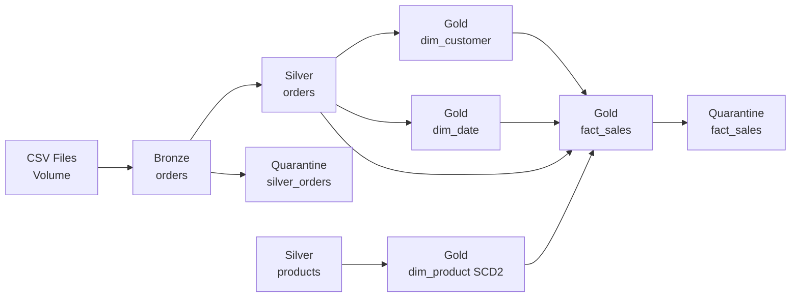

# RetailPulse: Databricks Lakehouse Retail Analytics Project

RetailPulse is an enterprise-grade Databricks Lakehouse project with **metadata-driven data quality, maintenance, and audit frameworks**.

## Architecture Overview

RetailPulse demonstrates two complementary architectures:

### 1. **Data Pipeline Architecture** (ETL/ELT)
- `Enterprise hybrid mode`: DLT for Bronze and Silver, Jobs/Workflows for Gold dimensions and facts
- Streaming ingestion and row-level DQ in DLT
- Business modeling in modular downstream jobs

### 2. **Metadata-Driven Framework Architecture** (Governance)
- Centralized metadata catalog for tables, columns, and validation rules
- Automated data quality validation
- Policy-driven table maintenance (OPTIMIZE/VACUUM/ANALYZE)
- Comprehensive audit logging and reporting

---

## 🔄 Complete End-to-End Execution Order

### **STEP 1: Data Pipeline (Every 4 hours)**
**Job**: `RetailPulse Enterprise Orchestrator` (ID: 869046484148482)  
**Duration**: ~15-20 minutes

**Tasks**:
1. **bronze_silver_dlt** - DLT Pipeline
   - Ingests CSV files → Bronze layer (`retailpulse.bronze.orders`)
   - Validates & cleanses → Silver layer (`retailpulse.silver.orders`)
   - Captures invalid records → Quarantine (`retailpulse.ops.silver_orders_quarantine`)

2. **gold_dims_facts** - Gold Layer Job
   - Builds product master (`retailpulse.silver.products`)
   - Builds SCD2 product dimension (`retailpulse.gold.dim_product`)
   - Builds customer dimension (`retailpulse.gold.dim_customer`)
   - Builds date dimension (`retailpulse.gold.dim_date`)
   - Builds sales fact table (`retailpulse.gold.fact_sales`)
   - Captures unresolved facts → Quarantine (`retailpulse.ops.fact_sales_quarantine`)

---

### **STEP 2: Data Quality Validation (After STEP 1)**
**Notebook**: `RetailPulse/01_DQ_Framework/03_DQ_Framework`  
**Duration**: ~5-10 minutes  
**Dependency**: Requires fresh data from STEP 1

**Operations**:
1. **Freshness Checks** - Validate SLA compliance (last_altered timestamps)
2. **Quality Rules Checks** - Validate column constraints (NOT_NULL, POSITIVE, DATE_VALID, etc.)
3. **Completeness Checks** - Validate row counts

**Logs to**: `retailpulse.ops.dq_validation_audit`

---

### **STEP 3: Table Maintenance (Weekly - Sunday 1 AM)**
**Notebook**: `RetailPulse/02_Maintenance/04_Maintenance_Framework`  
**Duration**: ~30-60 minutes  
**Independent**: Can run anytime

**Operations**:
1. **OPTIMIZE** - Compact small files for query performance
2. **ZORDER** - Co-locate related data (order_date, customer_id)
3. **VACUUM** - Remove old files to reclaim storage
4. **ANALYZE** - Collect table statistics for query optimization

**Logs to**: `retailpulse.ops.maintenance_audit`

---

### **STEP 4: Health Reporting (Daily 9 AM / On-Demand)**
**Notebook**: `RetailPulse/03_Reporting/05_Audit_Reporting`  
**Duration**: ~2-5 minutes

**Reports**:
- DQ check pass rates and trends
- ETL job performance metrics
- Maintenance operation effectiveness
- Executive dashboard

**Reads from**: All audit tables in `retailpulse.ops.*`

---

## 📋 Quick Reference: Execution Frequency

| Step | What to Run | When | Dependency |
|------|-------------|------|------------|
| 1️⃣ | RetailPulse Enterprise Orchestrator | Every 4 hours | None (runs first) |
| 2️⃣ | 03_DQ_Framework | After Step 1 | Requires fresh data |
| 3️⃣ | 04_Maintenance_Framework | Weekly (Sundays) | Independent |
| 4️⃣ | 05_Audit_Reporting | Daily / On-demand | Requires audit data |

---

## 📂 Project Structure (Organized by Function)

```text
RetailPulse/
├── 00_Setup/                    # One-time setup (run once)
│   ├── 01_Setup_Audit_Tables
│   └── 02_Metadata_Configuration
├── 01_DQ_Framework/             # Data quality validation (run after data load)
│   └── 03_DQ_Framework
├── 02_Maintenance/              # Table optimization (run weekly)
│   └── 04_Maintenance_Framework
├── 03_Reporting/                # Health monitoring (run daily)
│   └── 05_Audit_Reporting
├── 04_Orchestration/            # Reserved for future pipeline notebooks
├── 05_Documentation/            # Architecture & guides
│   └── RetailPulse Framework Architecture
├── 06_Testing/                  # Comprehensive unit test suite
│   ├── test_cases/              # Test case artifacts
│   ├── Unit_Test_Suite          # Master test suite (reference)
│   ├── Test_01_Schema_Validation
│   ├── Test_02_Metadata_Integrity
│   ├── Test_03_Freshness_Logic
│   ├── Test_04_Quality_Rules
│   ├── Test_05_Completeness_Checks
│   └── Test_06_Advanced_Tests
├── 07_MCP-AgentBricks/          # MCP Server integration & agent utilities
│   └── DQ_Validation_MCP_Server # UC-registered DQ validation functions
├── 99_Archive/                  # Archived utilities
│   └── src/utils/
├── notebooks/                   # Active data pipeline notebooks
│   ├── 08_dlt_e2e_main_refresh.py
│   ├── 09_product_master.py
│   ├── 10_dim_product.py
│   ├── 11_dim_customer.py
│   ├── 12_dim_date.py
│   └── 13_fact_sales.py
├── config/                      # Job & pipeline configurations
│   ├── dlt_bronze_silver_pipeline.json
│   ├── job_gold_dims_facts.json
│   └── job_enterprise_orchestrator.json
├── .ai/                         # AI context and skills
│   ├── context/
│   ├── skills/
│   └── prompts/
└── README.MD                    # This file
```

---

## 🧪 Testing Framework

### **Test Suite Overview**
RetailPulse includes a comprehensive unit test suite with **28 test cases (UTC-001 to UTC-028)** organized across 6 test notebooks:

| Test Suite | Test Cases | Coverage |
|------------|-----------|----------|
| **Test_01_Schema_Validation** | UTC-001 to UTC-005 | Audit table schema validation |
| **Test_02_Metadata_Integrity** | UTC-006 to UTC-008 | Metadata catalog data validation |
| **Test_03_Freshness_Logic** | UTC-009 to UTC-011 | SLA and freshness checks |
| **Test_04_Quality_Rules** | UTC-012 to UTC-016 | Validation rule logic (NOT_NULL, POSITIVE, etc.) |
| **Test_05_Completeness_Checks** | UTC-017 to UTC-019 | Row count and empty table detection |
| **Test_06_Advanced_Tests** | UTC-020 to UTC-028 | DQ logging, error handling, integration tests |

### **Running Tests**
```python
# Run individual test suites
%run ./06_Testing/Test_01_Schema_Validation
%run ./06_Testing/Test_02_Metadata_Integrity
# ... etc

# Or run the master suite
%run ./06_Testing/Unit_Test_Suite  # All 28 tests
```

### **Test Features**
* Automated pass/fail status tracking
* Visual test result indicators (✓/✗)
* Detailed error messaging
* Summary statistics (pass rate, failures)
* Mock data generation for isolated testing
* Zero impact on production data

---

## 🔌 MCP Integration (Model Context Protocol)

### **DQ Validation MCP Server**
Location: `RetailPulse/07_MCP-AgentBricks/DQ_Validation_MCP_Server`

The MCP Server exposes DQ validation functions as discoverable tools in Unity Catalog:

**Available Functions:**
* `retailpulse.ops.list_dq_checks()` - List available validation checks
* `retailpulse.ops.get_dq_notebook_path()` - Get MCP notebook location
* `retailpulse.ops.get_check_info(check_name)` - Get documentation for specific checks

**Python Functions:**
* `check_table_freshness(table_name, timestamp_column, max_age_hours)`
* `validate_referential_integrity(child_table, child_column, parent_table, parent_column)`
* `detect_data_drift(table_name, baseline_stats)`
* `run_quality_rules(table_name, rules)`
* `generate_dq_report(catalog, schema)`

**Usage:**
```sql
-- Discover registered DQ tools
SHOW FUNCTIONS IN retailpulse.ops;
SELECT * FROM retailpulse.ops.dq_validation_catalog;

-- Get function documentation
SELECT retailpulse.ops.get_check_info('freshness');
```

---

## 🗄️ Data Architecture

### **Medallion Layers**


### **Audit & Governance Tables**
All stored in `retailpulse.ops` schema:

| Table | Purpose | Updated By |
|-------|---------|------------|
| `metadata_catalog` | Central registry for tables, columns, rules, policies | Manual config |
| `dq_validation_audit` | Logs DQ check results | DQ Framework |
| `etl_job_audit` | Tracks ETL pipeline runs | Orchestrator Job |
| `maintenance_audit` | Records OPTIMIZE/VACUUM/ANALYZE ops | Maintenance Framework |
| `table_change_audit` | Captures data lineage & changes | Trigger-based |

---

## 🚀 Initial Setup (One-Time)

### 1. Create Audit Tables & Configure Metadata
```bash
# Run these notebooks once
RetailPulse/00_Setup/01_Setup_Audit_Tables
RetailPulse/00_Setup/02_Metadata_Configuration
```

### 2. Create DLT Pipeline
```powershell
databricks pipelines create --json @config/dlt_bronze_silver_pipeline.json --profile <your-profile>
```

### 3. Create Orchestrator Job
```powershell
databricks jobs create --json @config/job_enterprise_orchestrator.json --profile <your-profile>
```

### 4. Validate Test Framework (Optional)
```python
# Run test suites to validate framework setup
%run ./06_Testing/Test_01_Schema_Validation
```

---

## 📅 Recommended Scheduling (Databricks Jobs)

### Job 1: RetailPulse Enterprise Orchestrator
```yaml
Schedule: 0 0 0,4,8,12,16,20 * * ? *  # Every 4 hours
Timeout: 30 minutes
Alerts: Email on failure
```

### Job 2: RetailPulse DQ Validation
```yaml
Notebook: RetailPulse/01_DQ_Framework/03_DQ_Framework
Schedule: 0 0 6,18 * * ? *  # Twice daily at 6 AM and 6 PM
Dependency: Runs after Orchestrator succeeds
Timeout: 30 minutes
Alerts: Email on failure
```

### Job 3: RetailPulse Maintenance
```yaml
Notebook: RetailPulse/02_Maintenance/04_Maintenance_Framework
Schedule: 0 0 1 ? * SUN *  # Sundays at 1 AM
Timeout: 2 hours
Alerts: Email on failure
```

### Job 4: RetailPulse Health Report (Optional)
```yaml
Notebook: RetailPulse/03_Reporting/05_Audit_Reporting
Schedule: 0 0 9 * * ? *  # Daily at 9 AM
Timeout: 15 minutes
Output: Email summary to leadership
```

### Job 5: RetailPulse Test Suite (Optional)
```yaml
Notebook: RetailPulse/06_Testing/Unit_Test_Suite
Schedule: On-demand or after major changes
Timeout: 15 minutes
Alerts: Email on test failures
```

---

## 🔍 Validation Queries

### Data Pipeline Validation
```sql
-- Bronze/Silver/Gold counts
SELECT COUNT(*) FROM retailpulse.bronze.orders;
SELECT COUNT(*) FROM retailpulse.silver.orders;
SELECT COUNT(*) FROM retailpulse.silver.products;
SELECT COUNT(*) FROM retailpulse.gold.dim_product;
SELECT COUNT(*) FROM retailpulse.gold.dim_customer;
SELECT COUNT(*) FROM retailpulse.gold.dim_date;
SELECT COUNT(*) FROM retailpulse.gold.fact_sales;

-- Quarantine counts
SELECT COUNT(*) FROM retailpulse.ops.silver_orders_quarantine;
SELECT COUNT(*) FROM retailpulse.ops.fact_sales_quarantine;
```

### Framework Health Validation
```sql
-- Recent DQ checks
SELECT check_category, status, COUNT(*) 
FROM retailpulse.ops.dq_validation_audit 
WHERE run_timestamp >= current_timestamp() - INTERVAL 24 HOURS
GROUP BY check_category, status;

-- Recent maintenance operations
SELECT operation, status, COUNT(*)
FROM retailpulse.ops.maintenance_audit
WHERE start_time >= current_timestamp() - INTERVAL 7 DAYS
GROUP BY operation, status;

-- DQ pass rate
SELECT 
  ROUND(SUM(CASE WHEN status = 'PASS' THEN 1 ELSE 0 END) * 100.0 / COUNT(*), 2) AS pass_rate_pct
FROM retailpulse.ops.dq_validation_audit
WHERE run_timestamp >= current_timestamp() - INTERVAL 7 DAYS;
```

### Test Framework Validation
```sql
-- Verify audit tables exist
SHOW TABLES IN retailpulse.ops;

-- Check metadata catalog configuration
SELECT table_id, catalog_name, schema_name, table_name, is_active, sla_hours
FROM retailpulse.ops.metadata_catalog
WHERE is_active = true
ORDER BY catalog_name, schema_name, table_name;
```

---

## 📊 Key Tables Reference

### Bronze Layer
* `retailpulse.bronze.orders` - Raw order data from CSV files

### Silver Layer
* `retailpulse.silver.orders` - Validated and deduplicated orders
* `retailpulse.silver.products` - Product master data

### Gold Layer
* `retailpulse.gold.dim_product` - Product dimension (SCD Type 2)
* `retailpulse.gold.dim_customer` - Customer dimension
* `retailpulse.gold.dim_date` - Date dimension
* `retailpulse.gold.fact_sales` - Sales fact table

### Ops Layer (Audit & Quarantine)
* `retailpulse.ops.metadata_catalog` - Table configuration registry
* `retailpulse.ops.dq_validation_audit` - DQ validation results
* `retailpulse.ops.etl_job_audit` - ETL job execution logs
* `retailpulse.ops.maintenance_audit` - Maintenance operation logs
* `retailpulse.ops.table_change_audit` - Schema/data change tracking
* `retailpulse.ops.silver_orders_quarantine` - Invalid silver records
* `retailpulse.ops.fact_sales_quarantine` - Unresolved fact records

---

## 🔐 Security & Governance

* Unity Catalog for table-level access control
* Row-level security via Unity Catalog functions (available)
* Column masking via Unity Catalog (available)
* Audit logging for all DQ checks and maintenance operations
* Metadata-driven validation rules stored securely in `metadata_catalog`

---

## 🚧 Known Limitations & Future Enhancements

### Current Limitations
1. SCD Type 2 joins use `is_current = true` instead of date-range joins (due to synthetic data timing)
2. DQ validation is scheduled rather than real-time
3. Test suite requires manual execution

### Planned Enhancements
1. Historical date-range joins for SCD Type 2 in production
2. Real-time DQ validation via Delta Live Tables expectations
3. Automated test execution on pipeline changes
4. Additional MCP Server functions for advanced analytics
5. Integration with external monitoring tools (DataDog, Prometheus)

---

## 📚 Additional Resources

* **Architecture Documentation**: `.ai/context/architecture.md`
* **Data Model**: `.ai/context/data_model.md`
* **Coding Standards**: `.ai/context/coding_standards.md`
* **Pipeline Skills**: `.ai/skills/` (bronze, silver, SCD2, facts)
* **MCP Integration**: `07_MCP-AgentBricks/DQ_Validation_MCP_Server`
* **Test Suites**: `06_Testing/` (28 comprehensive test cases)

---

## 🤝 Contributing

When adding new tables or pipelines:
1. Update `metadata_catalog` with table configuration
2. Define validation rules in `validation_rules` column
3. Add test cases to appropriate test suite in `06_Testing/`
4. Update `.ai/context/architecture.md` with table relationships
5. Document new MCP functions in `07_MCP-AgentBricks/` if applicable

---

## 📞 Support

For questions or issues:
* Review test suite results in `06_Testing/`
* Check audit tables in `retailpulse.ops.*`
* Consult architecture documentation in `.ai/context/`
* Use MCP Server functions for DQ insights

---

**Project Version**: 2.0  
**Last Updated**: 2026-03-31  
**Maintainer**: RetailPulse Data Engineering Team